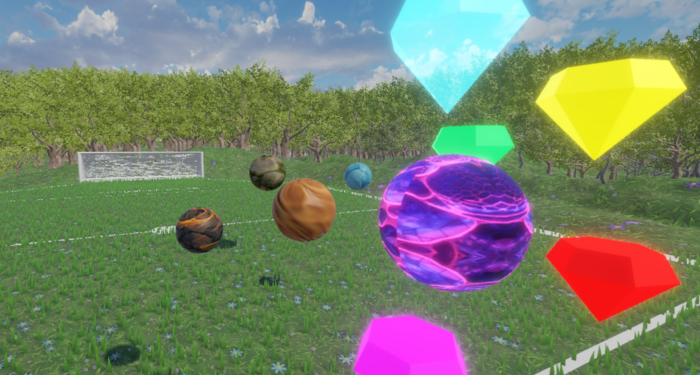
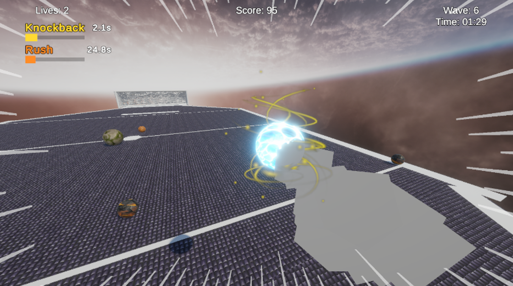
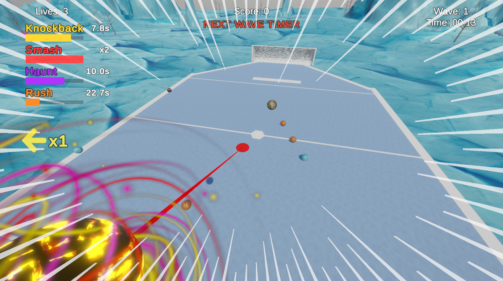

# Supersonic Acrobatic Rocket-Powered Battle-Balls (SARPBB for short)

DO YOU HAVE WHAT IT TAKES TO PROTECT YOUR NET AGAINST ALL ODDS?

ARE YOU PASSIONATE ABOUT KNOCKING OPPONENTS FOR THE THRILL?

DO YOU LIKE HIGH SPEED AND DESTRUCTION?

THEN THIS GAME IS FOR YOU!

(A 3D soccer/sumo ball game where you knock enemy balls into their goal while defending your own)

## Gameplay

**Combat:**

- Knock enemies into the Enemy Goal by ramming into them
- Enemies get stunned on hit and briefly drift toward their own goal
- Each enemy scores depending on type, each enemy that reaches your goal = -1 life
- 3 lives total, game over when they run out

**Waves:**

- Enemies spawn in waves, with wave size increasing each round
- "Wave Clear!" appears when all enemies are eliminated, followed by a countdown to the next wave
- Player position and velocity reset between waves

**Powerup Spawning:**

- Powerups spawn dynamically — ~50% chance per enemy scored, plus auto-spawn after 30s drought
- Up to 3 powerups active in the world at once, placed at designer-set spawn points
- One powerup per spawn point — occupied spots are skipped

**Movement:**

- WASD movement relative to camera direction
- Mouse-controlled orbiting camera
- Jump with spacebar
- Turbo dash on shift with smoke trail

**Powerups:**

Five powerup types, all stackable:

- **Knockback:** Boosted push force on contact for a duration. Stacks extend time
- **Smash:** Launch into the air, slow-mo aim, dive-bomb with AOE knockback. Each pickup adds a charge, consumed on use
- **Shield:** AOE barrier that destroys nearby enemies on contact with a shrink animation. Each stack gives 3 absorbs before breaking
- **Giant:** Grow massive and squish enemies flat on contact. Camera pulls back while active. Stacks extend duration
- **Haunt:** Touched enemies aggressively home toward their own goal. Haunted enemies spread haunt to normal enemies on collision (shared remaining duration). Stacks extend duration

**RUSH (Passive Ability):**

- Charges passively over time — press Q when the bar is full
- While active: player speed boosted, all enemies globally slowed, music fades out
- HUD bar always visible showing charge progress, "READY (Q)" state, and active drain

**Enemy Types:**

All enemy types can appear from wave 1, controlled by weighted spawn chance sliders:

- **Normal:** Steady march toward your goal
- **Aggressive:** High acceleration, rams the player when within detect radius
- **Evasive:** Advances toward goal with periodic sideways zigzag dodges
- **Tank:** Big (2x scale), heavy (3x mass), and slow (0.5x speed)

## Controls

- **WASD:** Move
- **Mouse:** Camera orbit
- **Space:** Jump
- **Shift:** Turbo dash
- **F:** Smash attack (when charged) / Confirm dive (during aiming)
- **Q:** Activate RUSH (when fully charged)
- **Escape:** Pause

## Features

- Wave-based spawning with countdown between waves
- 4 EPIC BIOMES TO CHOOSE FROM!!11!1111
- Dynamic powerup spawning (score-triggered + drought timer)
- Weighted enemy type distribution with per-type chance sliders
- Powerup stacking with visual indicators
- 3-phase targeted smash aiming system with slow-mo and overshoot protection
- RUSH passive ability with enemy slowdown and music fade
- Speed lines that intensify at high speed
- Powerup color overlay shader with animated noise blending
- Pixelation post-processing with adjustable pixel size
- Skin selection with persistence across sessions
- Main menu with physics-based smash navigation and tutorial browser
- Biome selection screen with multiple playable environments
- Settings panel (pixel size, music volume, grass toggle)
- Pause and game over screens with score/wave tracking

## Team Roles

- **Saif Alafeefi**: Programming (gameplay systems, powerups, enemy AI, optimization)
- **Fahad Alhashimi**: Level design (biome maps, arena layout, environment art, assets)
- **Mohamed Almehairbi**: UI/UX, sound design (menus, HUD, SFX, music), and the glorious game title

## Credits

Built for COSC 495 Introduction to Game Development, based on Unity's Create with Code "Challenge 4" template.
Modified and extended with custom powerup, combat, enemy AI, camera, audio, and menu systems.
